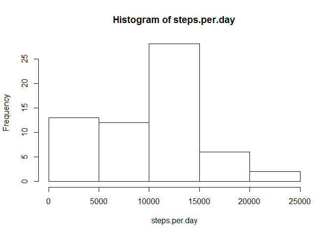
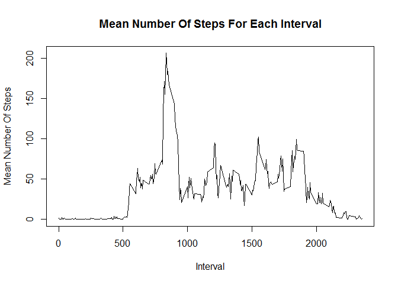
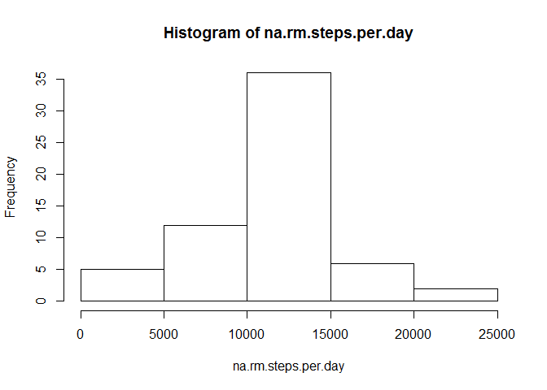
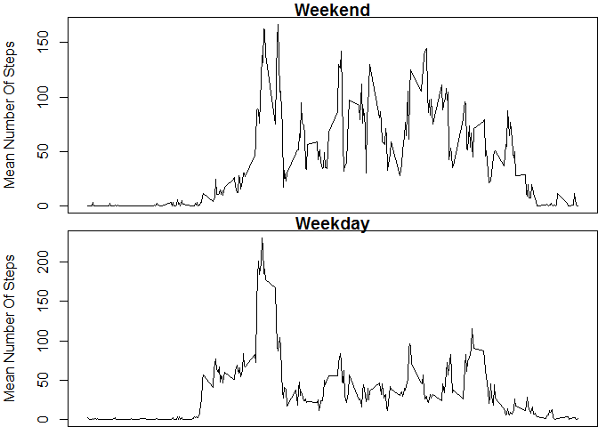

# Reproducible Research: Peer Assessment 1


## Loading and preprocessing the data


```r
#create temporary directory and placeholder file
td <- tempdir() 
tf <- tempfile(tmpdir=td, fileext=".zip")  

#download file to temporary file
url <- "http://d396qusza40orc.cloudfront.net/repdata%2Fdata%2Factivity.zip"
download.file(url, tf)

#get the name of the zip file and unzip
fname <- unzip(tf, list=TRUE)$Name[1]
unzip(tf, files=fname, exdir=td, overwrite=TRUE)

#get the full path to the extracted file
fpath = file.path(td, fname)

#read file into data frame
activity <- read.table(fpath, header=TRUE, sep=",", row.names=NULL)

#covert date column to date format from factor format
activity$date <- as.Date(activity$date, format = "%Y-%m-%d")
```


## What is mean total number of steps taken per day?

#### Record the total steps per day in the variable steps.per.day

```r
steps.per.day <- tapply(activity$steps, activity$date, sum, na.rm=T)
```

#### Make a histogram of the total steps per day

```r
hist(steps.per.day)
```

 

####Compute the mean and median total number of steps per day.

```r
daily.steps.mean <- round(mean(steps.per.day))
daily.steps.median <- median(steps.per.day)
```

The mean total number of steps taken per day is 9354.  
The median total number of steps taken per day is 10395.

## What is the average daily activity pattern?
#### Make a line plot of the daily average steps for each time interval

```r
interval.mean <- aggregate(steps ~ interval, activity, mean, na.rm=T)
plot(interval.mean$interval, interval.mean$steps, type="l", 
     main = "Mean Number Of Steps For Each Interval", 
     xlab = "Interval", 
     ylab = "Mean Number Of Steps")
```

 

#### Determine which interval had the highest daily average number of steps.

```r
interval.max <- interval.mean$interval[which.max(interval.mean$steps)]
```
Interval number 835 had the highest daily average number of steps.


## Imputing missing values
#### Determine the total number of missing values.

```r
missing <- sum(is.na(activity))
```
The total number of missing values is 2304.

#### Loop through the data frame and replace missing values with the interval means

```r
for (i in 1:length(activity$steps))
{
    if (is.na(activity$steps[i]))
    {
        activity$steps[i] <- interval.mean[interval.mean$interval==activity$interval[i], 2]
    }
}
```

#### Make a histogram of the total steps per day with missing data added

```r
na.rm.steps.per.day <- tapply(activity$steps, activity$date, sum)
hist(na.rm.steps.per.day)
```

 

#### Determine the mean and median of the new data

```r
na.rm.daily.steps.mean <- round(mean(na.rm.steps.per.day))
na.rm.daily.steps.median <- round(median(na.rm.steps.per.day))
```
The new mean is 1.0766\times 10^{4}.
The new median is 1.0766\times 10^{4}.
Both the mean and median have increased in value and both are now equal.

## Are there differences in activity patterns between weekdays and weekends?

#### Add a factor variable for the days of the week and plot mean steps on weekends vs weekdays

```r
#Add a new column for days of the week
activity$weekday <- as.factor(weekdays(activity$date))
#Subset the data frame into weekend and weekday data frames
weekend <- subset(activity, weekday=="Saturday" | weekday=="Sunday", select=c(steps, interval))
weekday <- subset(activity, weekday=="Monday" | weekday=="Tuesday" | weekday=="Wednesday" | weekday=="Thursday" | weekday =="Friday", select=c(steps, interval))
#Find the mean of each interval for both data frames
weekend.mean <- aggregate(steps ~ interval, weekend, mean)
weekday.mean <- aggregate(steps ~ interval, weekday, mean)
#Plot the two data frames using two frames
par(mfrow=c(2,1), mar=c(0,4,1,0))
plot(weekend.mean$interval, weekend.mean$steps, type="l",
     main="Weekend",
     xlab=NULL,
     xaxt="no",
     ylab="Mean Number Of Steps")
plot(weekday.mean$interval, weekday.mean$steps, type="l",
     main="Weekday",
     xlab="Interval", 
     ylab="Mean Number Of Steps")
```

 

```r
par(mfrow=c(1,1))
```

